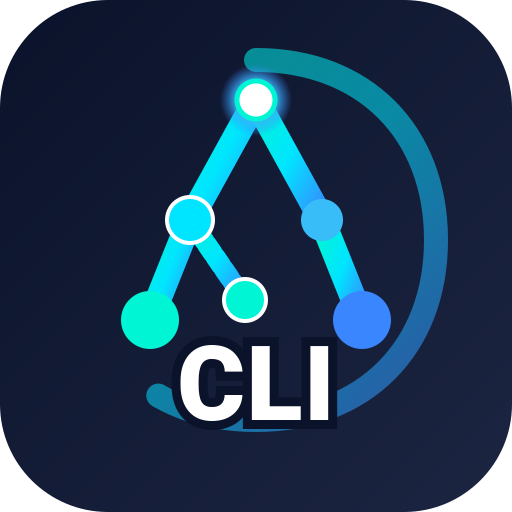

# ⚡ AMEVA-Multi-CLI

> **Enterprise-Grade Multi-Terminal & CLI Workbench for High-Density DevOps & Distributed Agent Operations**  
> *Infinite Recursive Splits · 80 FPS Smart PTY Batching · DevSecOps Command Shield · Live Port Manager & Process Killer · SQLite Snapshot Persistence*

<p align="center">
  
</p>

<p align="center">
  <a href="https://github.com/uno-km/AMEVA-Multi-CLI"></a>
  <a href="https://github.com/uno-km/AMEVA-Multi-CLI"></a>
  <a href="https://github.com/uno-km/AMEVA-Multi-CLI"></a>
  <a href="https://github.com/uno-km/AMEVA-Multi-CLI"></a>
  <a href="https://github.com/uno-km/AMEVA-Multi-CLI"></a>
  <a href="LICENSE"></a>
</p>

---

## 🌟 Overview: What is AMEVA-Multi-CLI?

**AMEVA-Multi-CLI**는 마이크로서비스 백엔드 개발, 분산 AI 에이전트 오케스트레이션, 인프라 DevOps 엔지니어링을 위해 설계된 **초경량·고성능 데스크톱 멀티 터미널 워크벤치**입니다.

일반적인 터미널 에뮬레이터(Windows Terminal, iTerm2, Hyper 등)가 단순 탭/스플릿 뷰에 그치는 반면, AMEVA-Multi-CLI는 **트리 기반 무한 분할 레이아웃**, **80 FPS 저지연 스마트 PTY 배치 파이프라인**, **파괴적 명령어 및 API 키 유출을 실시간 차단하는 DevSecOps 가드레일**, **포트 충돌을 1초 만에 해결하는 실시간 포트 매니저**, 그리고 **SQLite 기반 작업 환경 완전 영속화(스냅샷)** 기능을 단일 네이티브 바이너리로 결합했습니다.

---

## 🚀 5대 핵심 아키텍처 & 차별화 역량

### 1. 🔀 무한 재귀 분할 레이아웃 (Tree-Based Split Engine)
* **Zustand 기반 트리 상태 머신**: 단순 격자 그리드가 아닌 `PaneNode` 계층형 트리 구조로 수평(`horizontal`) 및 수직(`vertical`) 분할을 무한 중첩 지원.
* **동적 플렉스 가중치 리사이징 (`setPaneWeight`)**: 각 터미널 페인의 너비/높이를 직관적으로 드래그하여 조정 가능.
* **독립적 작업 디렉토리 (`cwd`) 유지**: 탭 및 페인별로 독립된 쉘 컨텍스트와 세션 ID(`nanoid`) 바인딩.

### 2. ⚡ 80 FPS 스마트 PTY 스트림 배치 (`PtyManager`)
* **12ms 다이내믹 플러시 스케줄러**: 대량의 로그나 빌드 출력이 쏟아질 때 IPC 병목을 방지하기 위해 12ms(~80 FPS) 단위로 데이터를 배치 전송.
* **대기 시 CPU 0% 보장**: 터미널에 데이터가 인입될 때만 타이머를 트리거하여 유휴 상태에서의 배터리 및 CPU 낭비를 100% 차단.
* **GPU 가속 캔버스 렌더러**: `@xterm/addon-canvas` 및 `@xterm/addon-fit`, `Unicode11Addon` 탑재로 한글/특수문자 깨짐 없는 초고속 렌더링.

### 3. 🛡️ DevSecOps 보안 쉴드 엔진 (Built-in Guardrails)
* **파괴적 명령어 실시간 인터셉터 (`DangerousCommandDetector`)**:
  - `rm -rf /`, `dd of=/dev/...`, `mkfs.*`, `format C:`, `del /s /q C:\`, 포크 밤(`:(){ :|:& };:`) 등 시스템을 파괴할 수 있는 명령어를 감지하여 강제 실행 차단 및 확인 팝업 호출.
* **민감 정보 실시간 마스킹 (`SecretMasker`)**:
  - 터미널 히스토리 및 로그 저장 시 `--password`, `token=`, `api_key=`, `Authorization: Bearer`, `AWS_SECRET_ACCESS_KEY`, `GITHUB_TOKEN` 등의 비밀값을 정규식으로 자동 탐지하여 `****`로 안전하게 마스킹.

### 4. 🔌 실시간 포트 매니저 & 프로세스 킬러 (Port Guard)
* **네이티브 프로세스-포트 동기화**: `netstat -ano`와 `tasklist`를 실시간 파싱하여 PID별 프로세스 이름, 점유 포트, 프로토콜(TCP/UDP)을 시각화.
* **시스템 프로세스 보호 필터 (`SYSTEM_PROCESSES`)**: `svchost.exe`, `explorer.exe`, `csrss.exe` 등 OS 핵심 프로세스는 강제 종료할 수 없도록 방어.
* **1-Click 충돌 해결**: `npm run dev`나 백엔드 서버 구동 시 포트가 점유되어 있을 때, 번거로운 CLI 명령 없이 UI에서 원클릭으로 해당 PID를 즉시 `taskkill`.

### 5. 💾 SQLite 임베디드 완전 영속화 (`better-sqlite3`)
* **세션 자동 복구 (`SessionRepository`)**: 앱 종료 직전의 탭 구성, 페인 트리, 활성 경로를 완벽하게 보존하여 재실행 시 100% 복원.
* **작업 공간 스냅샷 (`WorkspaceRepository`)**: 프로젝트별(예: "백엔드 개발 세트", "AI 서빙 모니터링 세트") 터미널 구성을 이름 붙여 스냅샷으로 저장 및 1초 만에 불러오기.
* **전체 명령어 전문 검색 (`HistoryRepository` / `HistorySearch`)**: 실행했던 모든 명령어를 초고속 인덱싱하여 검색 및 즉시 재실행.
* **원클릭 북마크 (`BookmarkRepository`)**: 자주 쓰는 긴 도커 명령어, 빌드 스크립트를 저장하고 파라미터 템플릿으로 실행.

---

## 🏗️ 시스템 아키텍처 다이어그램

```text
┌────────────────────────────────────────────────────────────────────────┐
│                   Electron Host Window (1280 x 800)                    │
│                                                                        │
│  ┌──────────────────────────────────────────────────────────────────┐  │
│  │ Top Bar: Tab Switcher · Workspace Snapshots · Live Port Manager  │  │
│  └──────────────────────────────────────────────────────────────────┘  │
│  ┌───────────────┬──────────────────────────────────────────────────┐  │
│  │               │   Multi-Split Terminal Workspace (xterm Canvas)  │  │
│  │   Sidebar:    │  ┌───────────────────────┬──────────────────────┐│  │
│  │   Bookmarks   │  │ Pane A: Node Dev (5173)│ Pane B: Fast API (:80)││  │
│  │   History     │  │ (PowerShell / zsh)    │ (Python 3.12 / venv) ││  │
│  │   Snapshots   │  ├───────────────────────┴──────────────────────┤│  │
│  │   Settings    │  │ Pane C: Docker Compose & Tail Logs (80 FPS)  ││  │
│  │               │  └──────────────────────────────────────────────┘│  │
│  └───────────────┴──────────────────────────────────────────────────┘  │
└───────────────────────────────────┬────────────────────────────────────┘
                                    │ IPC Bridge (contextIsolation)
┌───────────────────────────────────▼────────────────────────────────────┐
│                    Electron Main Process & Native Node                 │
│                                                                        │
│  ┌──────────────────┐  ┌───────────────────┐  ┌─────────────────────┐  │
│  │   PtyManager     │  │   SecurityShield  │  │   AppDatabase       │  │
│  │  (12ms Batching) │  │ (Secret & Cmd Det)│  │  (better-sqlite3)   │  │
│  └────────┬─────────┘  └───────────────────┘  └──────────┬──────────┘  │
└───────────┼──────────────────────────────────────────────┼─────────────┘
            ▼                                              ▼
    node-pty C++ Shells                          Local SQLite Storage
 (PowerShell / CMD / Bash)                       (Sessions, History, DB)
```

---

## ⌨️ 단축키 안내 (Keyboard Shortcuts)

| 단축키 | 기능 설명 |
| :--- | :--- |
| **`Ctrl + T`** | 새 터미널 탭 생성 |
| **`Ctrl + W`** | 현재 활성 터미널 페인 닫기 |
| **`Ctrl + Shift + E`** | 현재 페인을 수평(좌/우) 분할 |
| **`Ctrl + Shift + O`** | 현재 페인을 수직(상/하) 분할 |
| **`Ctrl + R`** | 명령어 히스토리 전문 검색 모달 열기 |
| **`Ctrl + Shift + P`** | 실시간 오픈 포트 매니저 패널 토글 |
| **`Ctrl + ,`** | 환경설정 (글꼴, 테마, 스크롤백 버퍼 크기) |

---

## 💻 빠른 시작 (Quick Start)

### 1. 개발 환경 실행

```bash
# 의존성 설치 및 C++ 네이티브 모듈(node-pty, better-sqlite3) 빌드
npm install

# 일렉트론 핫리로드 개발 서버 실행
npm run dev
```

### 2. 프로덕션 단독 실행 파일 (Portable EXE / Package) 빌드

```bash
# 타입 체크 및 Vite 프로덕션 빌드
npm run build

# 포터블 배포 패키지 생성 (dist/ 폴더에 생성)
npm run package
```

---

## 📁 디렉토리 구조 (Source Code Map)

```text
AMEVA-Multi-CLI/
├── build/                      # 앱 아이콘 및 리소스 자산
├── scripts/
│   └── patch-node-pty.js       # Windows/Electron 환경 C++ pty 호환성 패치
├── src/
│   ├── main/                   # 일렉트론 메인 프로세스
│   │   ├── db/                 # better-sqlite3 ORM 및 리포지토리
│   │   │   ├── Database.ts     # 테이블 스키마 초기화 및 마이그레이션
│   │   │   └── repositories/   # Bookmark, History, Session, Workspace, Settings
│   │   ├── ipc/                # IPC 통신 핸들러 (terminalIpc, systemIpc)
│   │   ├── pty/                # node-pty 프로세스 관리 및 12ms 배치 전송
│   │   ├── security/           # 위험 명령어 감지기 & API 키 마스킹
│   │   ├── splash/             # 앱 시작 스플래시 윈도우
│   │   └── index.ts            # 메인 프로세스 진입점 & 트레이 관리
│   │
│   ├── preload/                # IPC 브릿지 보안 노출 레이어 (contextBridge)
│   │
│   └── renderer/               # React 18 프론트엔드 UI
│       └── src/
│           ├── components/     # TerminalView, PaneRenderer, HistorySearch, PortPanel
│           ├── stores/         # tabStore.ts (Zustand 트리 기반 레이아웃 스토어)
│           ├── App.tsx         # 메인 워크벤치 뷰
│           └── main.tsx        # React 렌더러 진입점
├── package.json
└── tsconfig.json
```

---

## 🛡️ 기술 스택 및 의존성 규격

- **Runtime**: Electron 31.7.x, Node.js 20.x LTS
- **Frontend**: React 18, TypeScript 5.5, Zustand 4.5, Lucide Icons, Tailwind-like Minimalist CSS
- **Terminal Core**: `@xterm/xterm` 5.5.0, `@xterm/addon-canvas`, `@xterm/addon-fit`, `@xterm/addon-search`, `node-pty` 1.1.0-beta4
- **Database**: `better-sqlite3` 11.1.x
- **Build Pipeline**: `electron-vite` 2.3.x, `electron-builder` 24.13.x

---

## 📄 License & Credits

Released under the **[MIT License](LICENSE)**.  
Built with ❤️ as part of the **[AMEVA Ecosystem](https://github.com/uno-km)** by **[Uno Kim (@uno-km)](https://github.com/uno-km)**.
